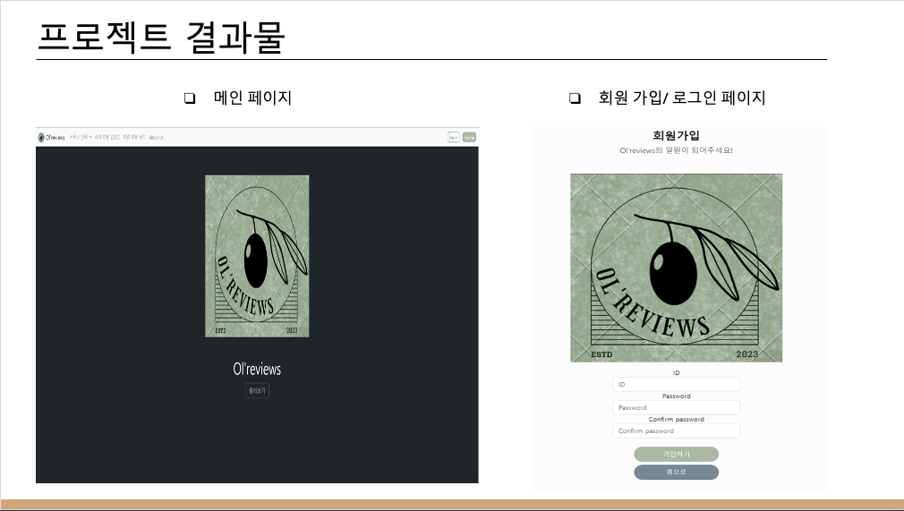
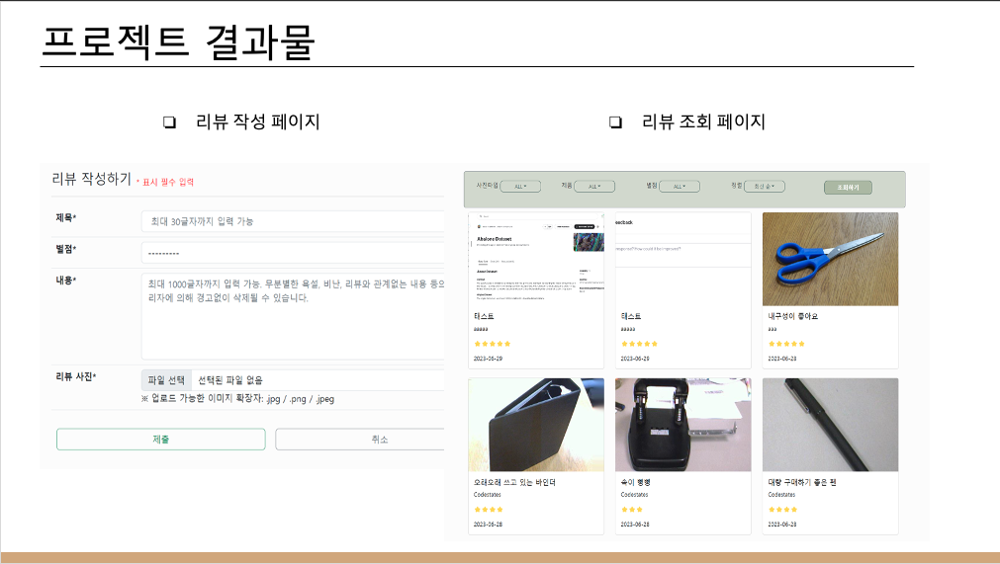

<h1>사무용품 이미지 AI 개선 프로젝트</h1>
<li>사무용품 이미지 AI Model 성능 개선 및 리뷰 웹 사이트 개발</li>
<li>테스트 배포 완료 (ngrok 활용)</li>

<h3>프로젝트 팀 구성 및 역할</h3>
<li>팀원 1 : YOLO v8 모델 제작 ( Class 분류 ), 데이터 수집 및 전처리</li>
<li>팀원 2 : CNN 모델 제작 ( Domain 분류 ), 데이터 수집 및 전처리</li>
<li>팀원 3 : 웹 페이지 개발, 데이터 수집 및 전처리</li>
<li>팀원 4 : 웹 페이지 개발, 데이터 수집 및 전처리, 배포</li>

<h3>프로젝트에서 수행한 내용</h3>
<li>CNN 모델 제작 ( Domain 분류 ), 데이터 수집 및 전처리</li>

 

<h1>프로젝트 개요</h1>

 
 

<h1>프로젝트 및 수행 내용 진행과정 </h1>

 

<h1>프로젝트 결과물</h1>

 

